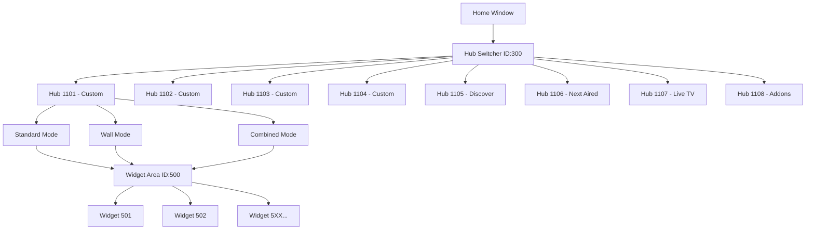
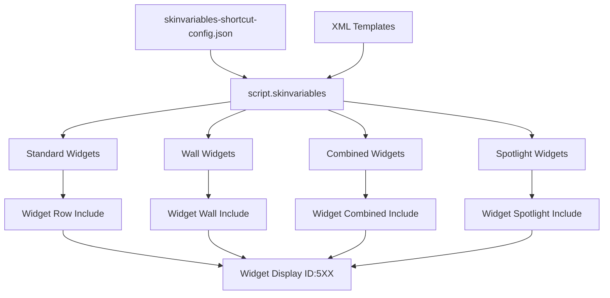
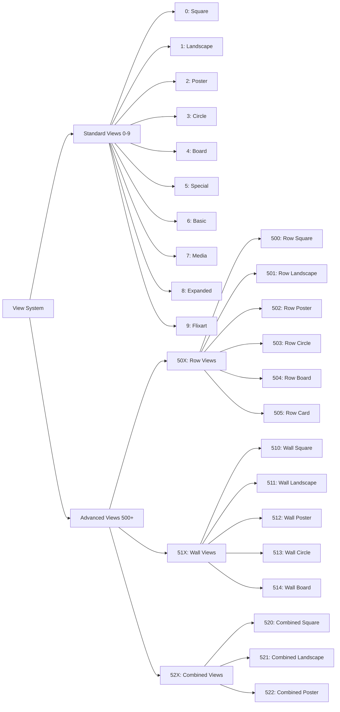
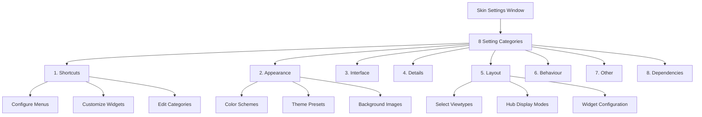
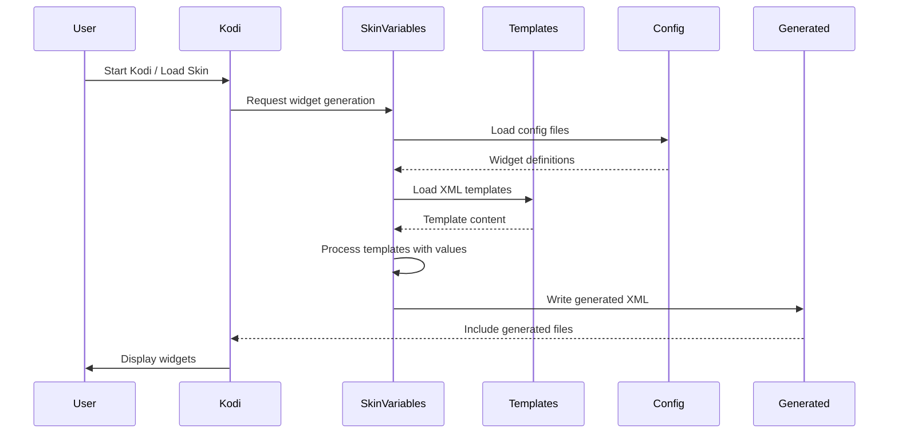

# Arctic Fuse 3 - Architecture Documentation

## Overview

**Arctic Fuse 3** is a minimal, row-based Kodi skin featuring a customizable hub and widget system. It provides a modern, clean interface with extensive customization options for media libraries, live TV, add-ons, and more.

**Version:** 3.0.6  
**Author:** jurialmunkey  
**License:** Creative Commons Attribution-NonCommercial-ShareAlike 4.0  
**Skin ID:** `skin.arctic.fuse.3`

---

## Core Architecture

### Design Principles

Arctic Fuse 3 is built on several core architectural principles:

1. **Modular Structure**: XML-based component system with extensive use of includes for reusability
2. **Hub-Based Navigation**: Multi-hub system allowing users to switch between different content areas
3. **Widget-Centric**: Dynamic widget generation system powered by script.skinvariables
4. **Flexible View Types**: Extensive view type system adaptable to different content types
5. **Template-Based Generation**: XML templates for dynamic content generation
6. **Multi-Resolution Support**: Adaptive layout for various screen aspect ratios

### Resolution Support

The skin supports 1080i resolution (1920x1080) with adaptive layouts for multiple aspect ratios:

- **16:9** (default) - 1920x1080
- **3:2** - 1620x1080
- **4:3** - 1440x1080
- **16:10** - 1728x1080
- **17:9** - 2040x1080
- **18:9** - 2160x1080
- **19.5:9** - 2340x1080
- **21:9** - 2520x1080

Each aspect ratio has corresponding constant files in `1080i/Includes_Constants_*.xml`.

### Entry Points

- **Home.xml**: Main entry point, displays hub-based home screen with widgets
- **SkinSettings.xml**: Skin configuration interface with categorized settings
- **Custom_*.xml**: Custom windows for hubs (1101-1108), dialogs, and utilities

---

## Component Systems

### 1. Hub System

The hub system provides the primary navigation structure, allowing users to switch between different content areas.



#### Hub Types

**Main Hubs (1101-1104)**: Customizable user-defined hubs
- Configurable names, icons, and content
- Support three display modes: Standard, Wall, Combined
- Each can contain multiple widgets

**Special Hubs:**
- **1105 (Discover)**: TMDb search and discovery
- **1106 (Next Aired)**: Upcoming TV episodes
- **1107 (Live TV)**: PVR/Live TV integration
- **1108 (Addons)**: Video/Music/Image addons

#### Hub Modes

**Standard Mode**: Row-based widget layout with spotlight option
```xml
<include condition="String.IsEmpty(Skin.String(HomeSwitcher.$PARAM[window].Mode))">
    skinvariables-$PARAM[window]widgets-standard
</include>
```

**Wall Mode**: Two-dimensional grid layout
```xml
<include condition="String.IsEqual(Skin.String(HomeSwitcher.$PARAM[window].Mode),Wall)">
    skinvariables-$PARAM[window]widgets-wall
</include>
```

**Combined Mode**: Split view with list and info panel
```xml
<include condition="String.IsEqual(Skin.String(HomeSwitcher.$PARAM[window].Mode),Combined)">
    skinvariables-$PARAM[window]widgets-combined
</include>
```

#### Hub Components

- **Hub Switcher (ID: 300)**: Main navigation control for switching between hubs
- **Spotlight Widget (ID: 301)**: Featured content area with hero display
- **Content Area (ID: 400)**: Main content display region
- **Widget Area (ID: 500)**: Container for widget grouplist
- **Switcher Control (ID: 601)**: Widget selector for wall/combined modes

---

### 2. Widget System

The widget system is the heart of Arctic Fuse 3, providing dynamic, customizable content displays.



#### Widget Types

1. **Row Widgets**: Horizontal scrolling lists
   - IDs: 5XX series (501, 502, 503, etc.)
   - Template: `widgets_row.xmltemplate`
   
2. **Wall Widgets**: Grid-based two-dimensional displays
   - Template: `widgets_wall.xmltemplate`
   - Support for panel controls with vertical navigation

3. **Combined Widgets**: Split view with list and detail panel
   - Template: `widgets_combined.xmltemplate`
   - Info panel integration

4. **Spotlight Widgets**: Featured hero content
   - ID: 301
   - Large format with metadata overlay

5. **Supplementary Widgets**: Additional content areas
   - IDs: 7XX series

#### Widget Generation Process

Widgets are dynamically generated using the `script.skinvariables` addon:

1. **Configuration**: Settings stored in JSON files
   - `skinvariables-shortcut-config.json`: Widget definitions and groupings
   - `skinvariables-generator.json`: Generation rules and templates

2. **Templates**: XML templates with placeholder variables
   ```xml
   <include content="Widget_Row">
       <param name="id">{widget_id}</param>
       <param name="label">{widget_label}</param>
       <param name="content">{widget_path}</param>
       <param name="visible">[{widget_category_visible}] + [{widget_visible}]</param>
   </include>
   ```

3. **Generation**: Templates are processed with actual values
   - Output: `script-skinvariables-generator-includes-*.xml`
   - Includes generated widgets for all hubs

4. **Runtime Loading**: Generated includes loaded dynamically
   ```xml
   <include file="script-skinvariables-generator-includes-.xml" 
            condition="String.IsEmpty(Skin.String(SkinVariables.SkinUser))" />
   ```

#### Widget Configuration

Widgets can be configured via Window 1115 (Shortcuts Dialog):
- Add/remove widgets
- Reorder widgets
- Configure widget properties
- Set visibility conditions
- Customize widget content paths

---

### 3. View Types

Arctic Fuse 3 provides an extensive view type system supporting various content types and layouts.



#### View Type Categories

**Row Views (50X)**
- One-dimensional horizontal scrolling
- Focus moves left/right
- Used for: Movies, TV Shows, Albums, etc.

**Wall Views (51X)**
- Two-dimensional grid layout
- Focus moves up/down/left/right
- Used for: Image libraries, large collections

**List Views (506-509)**
- Traditional vertical list layouts
- Basic, Media, Expanded, Flixart variants
- Used for: Detailed information display

**Combined Views (52X)**
- Split view with content list and info panel
- Synchronized selection and details
- Used for: Media libraries with metadata

**PVR Views (Special)**
- List Standard, List Info, List Details
- List Planner, List Outline
- Used for: Live TV, EPG, Recordings

#### View Configuration

Views are configured per content type in `skinviewtypes.json`:

```json
{
    "prefix": "Exp_View",
    "viewtypes": {
        "500": "31113",  // Row Square
        "501": "31112",  // Row Landscape
        "502": "31111"   // Row Poster
    },
    "rules": {
        "movies": {
            "rule": "Container.Content(movies)",
            "viewtypes": ["501", "502", "503", "504", "505"],
            "library": "502",
            "plugins": "502"
        }
    }
}
```

Users can select which view types are available for each content type via skin settings.

---

### 4. Shortcut System

The shortcut system manages menu items, power menu entries, and navigation shortcuts.

#### Shortcut Types

1. **Home Submenu**: Menu items under each hub
2. **Power Menu**: System actions (shutdown, reboot, etc.)
3. **Widget Shortcuts**: Quick access to widget content
4. **Context Menu**: Right-click actions

#### Shortcut Configuration Files

- `skinvariables-shortcut-config.json`: Main shortcut definitions
- `skinvariables-shortcut-homesubmenu.json`: Home menu items
- `skinvariables-shortcut-homewidgets.json`: Widget shortcuts
- `skinvariables-shortcut-powermenu.json`: Power menu items
- `skinvariables-shortcut-context.json`: Context menu entries

#### Shortcut Generation

Similar to widgets, shortcuts use template-based generation:

**Template** (`menu_item.xmltemplate`):
```xml
<item id="{menu_id}">
    <label>{menu_label}</label>
    <onclick>{menu_action}</onclick>
    <visible>{menu_visible}</visible>
</item>
```

**Generated Output**:
```xml
<item id="1">
    <label>Movies</label>
    <onclick>ActivateWindow(videos,videodb://movies/titles/)</onclick>
    <visible>Library.HasContent(movies)</visible>
</item>
```

---

### 5. Color and Theme System

Arctic Fuse 3 features a sophisticated color customization system.

#### Color Definition Structure

Base colors defined in `colors/defaults.xml`:

```xml
<colors>
    <!-- Main Foreground/Background -->
    <color name="main_fg_100">ffededed</color>
    <color name="main_fg_70">b3ededed</color>
    <color name="main_bg_100">ff000000</color>
    
    <!-- Dialog Colors -->
    <color name="dialog_fg_100">ffededed</color>
    <color name="dialog_bg_100">ff000000</color>
    
    <!-- Panel Colors -->
    <color name="panel_bg_70">b3000000</color>
    <color name="panel_fg_100">ffededed</color>
</colors>
```

#### Color Presets

Users can select from predefined color schemes:
- **Aqua Classic**
- **Tropical Sunset**
- **Miami Vaporwave**
- **Plain Monochrome**
- **Australian Summer**
- **Winter Frost**

Each preset modifies highlight colors, gradients, and accent colors.

#### Customizable Elements

- **Highlight Colors**: Focus indicators, selection colors
- **Background Style**: Solid colors, images, blur effects
- **Dialog Background**: Customizable dialog appearance
- **Window Background**: Per-window background customization
- **Text Colors**: Foreground color adjustments

---

### 6. Animation System

Arctic Fuse 3 uses a comprehensive animation system for smooth transitions.

#### Animation Types

**Window Transitions**:
```xml
<include name="Animation_View_WindowChange">
    <animation type="WindowOpen">
        <effect type="fade" start="0" end="100" time="300" />
    </animation>
    <animation type="WindowClose">
        <effect type="fade" start="100" end="0" time="200" />
    </animation>
</include>
```

**Focus Animations**:
- Zoom effects on focus
- Highlight expansion
- Color transitions

**Conditional Animations**:
- Slide effects for spotlight
- Fade in/out based on visibility
- Busy indicators during loading

**OSD Animations**:
- Seekbar slide transitions
- Control fade in/out
- Artwork display animations

---

## Features

### Content Features

- **Customizable Widgets**: Fully customizable row-based widget system with drag-and-drop reordering
- **Multiple Hub Layouts**: Standard, Wall, and Combined modes for different viewing preferences
- **Spotlight Feature**: Hero display for featured content with metadata overlay
- **Search & Discover**: Integrated TMDb search and discovery interface
- **Smart Playlists**: Support for custom playlists and filters
- **Media Hubs**: Dedicated hubs for Movies, TV Shows, Music, Pictures, Live TV, and Add-ons

### Navigation Features

- **Hub Switcher**: Quick horizontal navigation between content hubs
- **Submenu System**: Contextual submenus under each hub
- **Breadcrumb Navigation**: Clear indication of current location
- **Hidden Button System**: Keyboard shortcuts for advanced navigation
- **Touch Mode Support**: Optimized for touchscreen devices

### PVR Features

- **Live TV Integration**: Full PVR support with EPG
- **Channel Groups**: Organize channels into custom groups
- **Recording Management**: Schedule and manage recordings
- **Timeshift Support**: Pause and rewind live TV
- **Channel Guide**: Visual EPG with multiple view options

### Media Info Features

- **TMDb Integration**: Rich metadata from TheMovieDB
- **Cast Information**: Actor bios, filmographies, and photos
- **Ratings Display**: Multiple rating sources (IMDb, TMDb, Rotten Tomatoes)
- **Trailers**: Play trailers directly from info dialogs
- **Similar Content**: Recommendations based on current item
- **Extended Details**: Awards, budget, revenue, certifications

### Visual Features

- **FlixArt Display**: Large format artwork display
- **Background Blur**: Automatic background blur generation
- **Studio Logos**: Colored studio/network icons
- **Weather Icons**: Animated weather icon support
- **Custom Fonts**: Support for custom font files including CJK
- **Artwork Fallbacks**: Custom fallback images for missing artwork

### Customization Features

- **Color Schemes**: Multiple preset color schemes with custom highlight colors
- **View Type Selection**: Enable/disable view types per content type
- **Widget Layouts**: Customize widget size, spacing, and visibility
- **Settings Levels**: Basic, Detailed, and Expert settings modes
- **Skin User Profiles**: Pseudo-profile system for different widget configurations
- **Startup Customization**: Custom startup splash screens

---

## Settings System

Arctic Fuse 3 features a comprehensive settings system organized into categories.



### Setting Categories

#### 1. Shortcuts (Menu Configuration)
- **Configure Menus**: Enable/disable main hubs (Next Aired, Live TV, Addons)
- **Customize Widgets**: Access widget customization dialog (Window 1115)
- **Icon Mode**: Toggle icon display in menus
- **Additional Items**: Configure supplementary menu items

#### 2. Appearance (Visual Customization)
- **Color Scheme**: Select from preset color schemes
- **Customize Highlight Colors**: Adjust focus/selection colors
- **Window Background**: Choose solid colors, images, or blur effects
- **Dialog Background**: Customize dialog appearance
- **Startup Image**: Set custom startup splash screen
- **Skin Theme**: Light/Dark mode toggle

#### 3. Interface (UI Elements)
- **Header Configuration**: Show/hide header elements
- **Footer Configuration**: Configure footer display
- **Navigation Style**: Adjust navigation behavior
- **Mouse Pointer Size**: Adjust cursor size for different displays
- **On-Screen Keyboard**: Configure keyboard size and layout
- **Touch Mode**: Enable touchscreen optimizations

#### 4. Details (Information Display)
- **Information Panels**: Configure metadata display
- **Ratings Display**: Choose rating sources to display
- **Indicators**: Configure watched/unwatched indicators
- **Progress Bars**: Show/hide progress indicators
- **Codecs**: Display codec information
- **Studio Icons**: Show colored studio logos

#### 5. Layout (View Configuration)
- **Select Viewtypes**: Enable/disable view types per content type
- **Widget Configuration**: Adjust widget sizes and spacing
- **Hub Display Modes**: Set default hub mode (Standard/Wall/Combined)
- **FlixArt Size**: Choose artwork display size (Large/Extra Large)
- **Empty Widget Placeholder**: Show/hide placeholder for empty widgets

#### 6. Behaviour (Functional Settings)
- **Navigation Behavior**: Configure navigation patterns
- **Autoscroll**: Enable automatic label scrolling
- **Autoscroll Interval**: Set scrolling speed
- **OSD Autoclose**: Configure OSD timeout
- **Seekbar Behavior**: Adjust delayed pause settings
- **Trailers**: Configure trailer playback options
- **Extra Fanart**: Enable background fanart cycling

#### 7. Other (Miscellaneous)
- **Translations**: Language and localization settings
- **Visualisation**: Music visualisation settings
- **Holiday Themes**: Enable seasonal themes
- **Skin User Profiles**: Configure pseudo-profiles
- **Reset Options**: Reset skin to defaults

#### 8. Dependencies (Addon Information)
- Display required and optional addon information
- Links to addon settings
- Compatibility information

### Settings Level System

Settings visibility is controlled by expertise level:

- **Level 1 (Basic)**: Essential settings only
- **Level 2 (Detailed)**: Standard + advanced options
- **Level 3 (Expert)**: All settings including experimental features

Users can cycle through levels in the settings interface:
```xml
<onclick condition="Integer.IsEqual(Skin.String(Skin.SettingsLevel),1)">
    Skin.SetString(Skin.SettingsLevel,$NUMBER[2])
</onclick>
<onclick condition="Integer.IsEqual(Skin.String(Skin.SettingsLevel),2)">
    Skin.SetString(Skin.SettingsLevel,$NUMBER[3])
</onclick>
<onclick condition="Integer.IsEqual(Skin.String(Skin.SettingsLevel),3)">
    Skin.SetString(Skin.SettingsLevel,$NUMBER[1])
</onclick>
```

---

## Dependencies

Arctic Fuse 3 requires several addons to function properly.

### Required Dependencies

#### Core Dependencies

**xbmc.gui** (v5.17.0+)
- Kodi GUI framework
- Provides base window and control types
- Required for all skin functionality

**script.skinvariables** (v2.1.28+)
- Dynamic widget and shortcut generation
- Template processing engine
- Configuration file management
- Critical for widget system functionality

**script.texturemaker** (v0.2.9+)
- Dynamic texture generation
- Color gradient creation
- Icon manipulation
- Used for highlight colors and custom textures

#### Content Enhancement

**plugin.video.themoviedb.helper** (v6.12.11+)
- TMDb metadata integration
- Actor information and filmographies
- Similar content recommendations
- Image blur generation
- Discover/search functionality
- Player integration

#### Resource Addons

**resource.images.weathericons.white** (v0.0.1+)
- Weather icon resources
- Used in weather widgets

**resource.images.studios.coloured** (v0.0.1+)
- Colored studio and network logos
- Used in media information displays

**resource.font.robotocjksc** (v0.0.3+)
- CJK (Chinese, Japanese, Korean) font support
- Required for non-Latin character display

### Optional Dependencies

While not required, these addons enhance functionality:

- **script.module.requests**: HTTP library for API calls
- **script.module.urllib3**: URL handling
- **script.module.chardet**: Character encoding detection
- **Next Aired Service**: Enhanced next aired functionality
- **Arctic Waves Resource**: Animated background waves

---

## File Structure

```
skin.arctic.fuse.3/
├── addon.xml                          # Addon manifest and dependencies
├── LICENSE.txt                        # CC-NC-SA 4.0 license
├── Readme.md                          # Basic readme
├── icon.png                           # Skin icon
├── fanart.jpg                         # Skin fanart
│
├── 1080i/                             # Main skin XML files (203 files)
│   ├── Home.xml                       # Home window (main entry point)
│   ├── SkinSettings.xml               # Skin settings window
│   ├── IDs                            # Control ID reference documentation
│   │
│   ├── Custom_*.xml                   # Custom windows
│   │   ├── Custom_1101_Hub.xml        # Hub window 1101
│   │   ├── Custom_1115_Window_Shortcuts.xml  # Widget customization
│   │   ├── Custom_1180_Wizard.xml     # Setup wizard
│   │   └── ...
│   │
│   ├── Dialog_*.xml                   # Dialog definitions
│   │   ├── Dialog_DialogSelect.xml
│   │   ├── Dialog_DialogContextMenu.xml
│   │   └── ...
│   │
│   ├── Includes*.xml                  # Modular include files
│   │   ├── Includes.xml               # Master include file
│   │   ├── Includes_Actions.xml       # Action definitions
│   │   ├── Includes_Animations.xml    # Animation system
│   │   ├── Includes_Background.xml    # Background components
│   │   ├── Includes_Colors.xml        # Color definitions
│   │   ├── Includes_Constants*.xml    # Resolution-specific constants
│   │   ├── Includes_Hubs.xml          # Hub system components
│   │   ├── Includes_Views*.xml        # View type definitions
│   │   ├── Includes_Widgets.xml       # Widget components
│   │   └── ...
│   │
│   ├── My*.xml                        # Standard Kodi windows
│   │   ├── MyVideoNav.xml             # Video library
│   │   ├── MyMusicNav.xml             # Music library
│   │   ├── MyPVR*.xml                 # PVR windows
│   │   └── ...
│   │
│   ├── Video*.xml                     # Video playback windows
│   │   ├── VideoFullScreen.xml        # Fullscreen video
│   │   ├── VideoOSD.xml               # Video OSD
│   │   └── ...
│   │
│   └── Font.xml                       # Font definitions
│
├── shortcuts/                         # Widget and shortcut configuration
│   ├── generator/                     # Template-based generation system
│   │   └── data/
│   │       ├── base/                  # Base configurations
│   │       │   ├── home_widgets*.xml  # Widget base configs
│   │       │   ├── home_submenu.xml   # Submenu base config
│   │       │   ├── power_*.xml        # Power menu configs
│   │       │   └── search_*.xml       # Search configs
│   │       │
│   │       ├── parts/                 # XML templates
│   │       │   ├── widgets_row.xmltemplate
│   │       │   ├── widgets_wall.xmltemplate
│   │       │   ├── widgets_combined.xmltemplate
│   │       │   ├── menu_item.xmltemplate
│   │       │   └── ...
│   │       │
│   │       └── setup/                 # Setup configurations
│   │           ├── widgets_*.xml      # Widget setup configs
│   │           ├── submenu_row.xml    # Submenu setup
│   │           └── powermenu_item.xml # Power menu setup
│   │
│   ├── builtins/                      # Built-in action definitions
│   │   ├── skinvariables-playtrailer.json
│   │   ├── skinvariables-closeosd.json
│   │   └── ...
│   │
│   ├── skinvariables-generator.json   # Generation configuration
│   ├── skinvariables.xml              # Skin variables
│   ├── skinvariables-labels.xml       # Label variables
│   ├── skinvariables-images.xml       # Image variables
│   ├── skinvariables-shortcut-*.json  # Shortcut configurations
│   ├── skinviewtypes.json             # View type configuration
│   └── skinvariables-startup.json     # Startup configuration
│
├── colors/                            # Color scheme definitions
│   ├── defaults.xml                   # Default color palette
│   └── Skin default - Light dialogs.xml  # Light theme variant
│
├── language/                          # Localization files
│   ├── resource.language.en_gb/       # English (UK)
│   │   └── strings.po                 # English strings (2142 strings)
│   └── resource.language.zh_cn/       # Chinese (Simplified)
│       └── strings.po                 # Chinese strings
│
├── extras/                            # Additional resources
│   ├── backgrounds/                   # Background images
│   │   ├── blur/                      # Blur overlays (8 JPG)
│   │   ├── dialogs/                   # Dialog backgrounds (9 PNG)
│   │   ├── launch/                    # Startup images (8 JPG)
│   │   └── music_colors/              # Music color overlays (8 PNG)
│   │
│   ├── hub/                           # Hub content definitions
│   │   ├── movies/                    # Movie hub content
│   │   │   ├── awards/                # Award filters (XSP files)
│   │   │   ├── lists/                 # Movie lists
│   │   │   ├── titles/                # Title filters
│   │   │   └── years/                 # Year filters
│   │   └── tvshows/                   # TV show hub content
│   │       ├── lists/
│   │       ├── titles/
│   │       └── years/
│   │
│   ├── icons/                         # Icon resources (1794 PNG files)
│   │   ├── [content type icons]
│   │   ├── [navigation icons]
│   │   └── [status icons]
│   │
│   ├── modes/                         # Hub mode preview images
│   │   ├── combined.jpg
│   │   ├── standard.jpg
│   │   └── wall.jpg
│   │
│   ├── nodes/                         # Library node definitions
│   │   └── videolibrary.json
│   │
│   ├── playlists/                     # Smart playlists (24 XSP files)
│   │
│   ├── profiles/                      # User profile images (15 JPG)
│   │
│   ├── tmdbhelper/                    # TMDbHelper configuration
│   │   └── baseitem.json
│   │
│   └── viewtypes/                     # View type preview images (22 JPG)
│
├── fonts/                             # Font files
│   ├── CommitMono-400-Regular.ttf     # Monospace font
│   ├── fa-solid-900.ttf               # Font Awesome icons
│   ├── Inter-Bold.ttf                 # Inter UI Bold
│   ├── Inter-Light.ttf                # Inter UI Light
│   ├── Inter-Regular.ttf              # Inter UI Regular
│   ├── LeagueSpartan-ExtraBold.ttf    # Display font
│   └── Questrial-Regular.ttf          # Body font
│
└── media/                             # Skin media assets (1391 files)
    ├── Textures.xbt                   # Compiled texture package
    └── [individual PNG textures]
```

### Key Files Explained

**addon.xml**: Defines skin metadata, dependencies, and resolution support

**1080i/Includes.xml**: Master include file that imports all component modules

**1080i/IDs**: Documentation file listing control ID conventions

**shortcuts/skinvariables-generator.json**: Configures the widget generation system

**shortcuts/skinvariables-shortcut-config.json**: Defines available shortcuts and groupings

**colors/defaults.xml**: Base color palette for the entire skin

**language/*/strings.po**: Localized strings (IDs 31000-31605)

---

## Technical Details

### Control ID System

Arctic Fuse 3 uses a systematic control ID scheme for organization:

```
VIEWS - Standard (0-9)
0  = Square
1  = Landscape
2  = Poster
3  = Circle
4  = Board
5  = Special
6  = Basic
7  = Media
8  = Expanded
9  = Flixart

VIEWS - Advanced
50X = Rows/Lists (one-dimensional views)
51X = Walls (two-dimensional views)
52X = Combined Control List
53X = Combined Content List

WIDGETS / HOME
300 = Hub Switcher
301 = Spotlight Widget
400 = Content Area
500 = Widgets Area
5XX = Widget IDs
600 = Switching Area
601 = Switcher Control
7XX = Widget IDs supplementary

WINDOWS
1101-1104 = Custom Hubs
1105      = Discover
1106      = Next Aired
1107      = Live TV
1108      = Addons
1115      = Shortcuts Dialog
1118      = Custom Dialog
1120      = Video Info
1123      = Trailer Dialog
1140      = Playlist OSD
1141      = Cast Info OSD
1161      = Weather Dialog
1170      = Search Dialog
1180      = Wizard
1181      = Info Menu
1190      = Info Dialog
1195      = Skin User Login
```

### Property System

Arctic Fuse uses window properties for state management:

**TMDbHelper Integration**:
```xml
<onload>SetProperty(TMDbHelper.WidgetContainer,301,Home)</onload>
```
Tells TMDbHelper which container to use for metadata

**Hub State**:
```xml
<onfocus>SetProperty(HomeSwitcher.IsVisible,True,Home)</onfocus>
```
Controls hub switcher visibility

**Widget Container**:
```xml
<onfocus>SetProperty(TMDbHelper.WidgetContainer,$PARAM[id])</onfocus>
```
Tracks currently focused widget for metadata display

**Background Control**:
```xml
<onfocus>SetProperty(Background.ShowOverlay,True,Home)</onfocus>
```
Controls background overlay visibility

### Expression System

Complex visibility conditions use expressions for reusability:

**Definition**:
```xml
<expression name="Exp_View_500">
    Skin.HasSetting(Exp_View_500_Enabled)
</expression>
```

**Usage**:
```xml
<visible>$EXP[Exp_View_500]</visible>
```

Common expression patterns:
- `Exp_View_*`: View type enablement
- `Exp_Navigation_*`: Navigation conditions
- `Exp_InfoDialogs`: Info dialog visibility
- `Exp_OSD_*`: OSD-related conditions

### Variable System

Variables provide dynamic values based on conditions:

**Example - Hub Names**:
```xml
<variable name="Home_Name_1101">
    <value condition="!String.IsEmpty(Skin.String(HomeSwitcher.1101.Name))">
        $INFO[Skin.String(HomeSwitcher.1101.Name)]
    </value>
    <value>$LOCALIZE[636]</value>
</variable>
```

Returns custom hub name if set, otherwise returns default localized string.

### Conditional Includes

Includes can be loaded conditionally:

**Resolution-Specific**:
```xml
<include file="Includes_Constants_21x9.xml" 
         condition="String.IsEqual(Skin.AspectRatio,21:9)" />
```

**Feature-Specific**:
```xml
<include file="script-skinvariables-skinusers.xml" 
         condition="!String.IsEmpty(Skin.String(SkinVariables.SkinUser))" />
```

### Parametric Includes

Includes support parameters for reusability:

**Definition**:
```xml
<include name="Widget_Row">
    <param name="id">501</param>
    <param name="label">Widget Label</param>
    <definition>
        <control type="list" id="$PARAM[id]">
            <label>$PARAM[label]</label>
        </control>
    </definition>
</include>
```

**Usage**:
```xml
<include content="Widget_Row">
    <param name="id">502</param>
    <param name="label">My Custom Label</param>
</include>
```

### Localization System

Strings use PO (Portable Object) format:

```po
msgctxt "#31000"
msgid "Live TV / PVR"
msgstr ""

msgctxt "#31001"
msgid "In-Progress Episodes"
msgstr ""
```

String IDs 31000-31605 are custom skin strings. Lower IDs are Kodi core strings.

### Font System

Font definitions in `Font.xml`:

```xml
<font>
    <name>font_main</name>
    <filename>Inter-Regular.ttf</filename>
    <size>32</size>
</font>
```

Fonts are referenced throughout the skin:
```xml
<font>font_main</font>
```

### Image System

Images can use:
- **Direct paths**: `special://skin/media/icon.png`
- **Variables**: `$VAR[Image_Background]`
- **InfoLabels**: `$INFO[ListItem.Art(fanart)]`
- **Diffuse masks**: For transparency and effects

### Animation System Detailed

Animations support multiple effect types:

**Fade**:
```xml
<effect type="fade" start="0" end="100" time="300" />
```

**Slide**:
```xml
<effect type="slide" start="0" end="0,100" time="400" tween="quadratic" />
```

**Zoom**:
```xml
<effect type="zoom" start="85" end="100" center="auto" time="300" />
```

**Rotate**:
```xml
<effect type="rotate" start="0" end="360" center="auto" time="1000" />
```

Animation conditions:
- `Conditional`: Based on boolean expression
- `WindowOpen`/`WindowClose`: On window transitions
- `Visible`/`Hidden`: On visibility changes
- `Focus`/`Unfocus`: On focus state changes

---

## Widget Generation Deep Dive

The widget generation system is central to Arctic Fuse 3's flexibility.

### Generation Flow



### Template Processing

Templates contain placeholder variables enclosed in `{braces}`:

**Template** (`widgets_row.xmltemplate`):
```xml
<include content="Widget_Row">
    <param name="id">{widget_id}</param>
    <param name="groupid">{widget_group_id}</param>
    <param name="label">{widget_label}</param>
    <param name="visible">[{widget_category_visible}] + [{widget_visible}]</param>
    <content sortby="{widget_sortby}" sortorder="{widget_sortorder}"
             target="{widget_target}" limit="{widget_limit}">
        {widget_path}
    </content>
</include>
```

**Configuration Data**:
```json
{
    "widget_id": "501",
    "widget_group_id": "500",
    "widget_label": "Recent Movies",
    "widget_path": "videodb://recentlyaddedmovies/",
    "widget_target": "videos",
    "widget_sortby": "dateadded",
    "widget_sortorder": "descending",
    "widget_limit": "20"
}
```

**Generated Output**:
```xml
<include content="Widget_Row">
    <param name="id">501</param>
    <param name="groupid">500</param>
    <param name="label">Recent Movies</param>
    <param name="visible">[True] + [True]</param>
    <content sortby="dateadded" sortorder="descending"
             target="videos" limit="20">
        videodb://recentlyaddedmovies/
    </content>
</include>
```

### Generator Configuration

`skinvariables-generator.json` controls the generation process:

```json
{
    "folder": "1080i",
    "output": "script-skinvariables-generator-includes-{skinuser}.xml",
    "header": "<?xml version=\"1.0\" encoding=\"UTF-8\"?>\n<includes>",
    "footer": "</includes>",
    "buildv": "0.0.1",
    "skinid": "skin.arctic.fuse.3",
    "global": {
        "parts_visible": {"template": "True"},
        "widget_category_visible": {"template": "True"}
    },
    "genxml": [
        {"datafile": "generator/data/base/home_widgets.xml"},
        {"datafile": "generator/data/base/home_submenu.xml"},
        {"datafile": "generator/data/base/power_main.xml"}
    ]
}
```

- **folder**: Output directory
- **output**: Output filename pattern
- **header/footer**: XML wrapper
- **global**: Default variable values
- **genxml**: List of data files to process

### Shortcut Groupings

The `skinvariables-shortcut-config.json` defines groupings for widget organization:

```json
{
    "grouping://shortcuts/": [
        {
            "name": "Videos",
            "path": "library://video/",
            "icon": "special://skin/extras/icons/video.png",
            "node": "videos"
        },
        {
            "name": "Music",
            "path": "library://music/",
            "icon": "special://skin/extras/icons/music.png",
            "node": "music"
        }
    ]
}
```

Users can browse these groupings when adding widgets.

---

## Development Notes

### Modular Architecture Benefits

1. **Maintainability**: Changes to one component don't affect others
2. **Reusability**: Includes can be used across multiple windows
3. **Scalability**: Easy to add new views, widgets, or hubs
4. **Customization**: Users can modify specific components
5. **Performance**: Conditional includes load only when needed

### Best Practices

**For Skinners**:
- Use parametric includes for repeated elements
- Define expressions for complex visibility conditions
- Use variables for dynamic content
- Follow the established ID numbering scheme
- Document custom includes and variables

**For Users**:
- Use skin settings rather than editing XML files
- Backup widget configurations before major changes
- Start with Basic settings level and advance as needed
- Use the wizard for initial setup

### Performance Considerations

- **Conditional Includes**: Load components only when needed
- **Widget Limits**: Configure appropriate item limits for widgets
- **Background Images**: Use compressed JPGs for backgrounds
- **Texture Optimization**: Media files are compiled into Textures.xbt
- **Empty Widget Hiding**: Can improve performance but may cause positioning issues

---

## Integration Points

### TMDbHelper Integration

Arctic Fuse 3 deeply integrates with TMDbHelper:

**Metadata Display**:
```xml
<label>$INFO[Window(Home).Property(TMDbHelper.ListItem.Title)]</label>
```

**Background Blur**:
```xml
<onload>RunScript(plugin.video.themoviedb.helper,blur_image=$VAR[Image_Background])</onload>
```

**Player Integration**:
```xml
<onclick>RunScript(plugin.video.themoviedb.helper,play_movie,tmdb_id=$INFO[ListItem.Property(tmdb_id)])</onclick>
```

### Script.SkinVariables Integration

Widget and shortcut generation is powered by script.skinvariables:

**Trigger Rebuild**:
```xml
<onclick>SetProperty(SkinVariables.ForceRebuild,True,Home)</onclick>
<onclick>ReloadSkin()</onclick>
```

**Access Properties**:
```xml
<visible>!String.IsEmpty(Skin.String(Shortcuts.RebuildDateTime))</visible>
```

### Kodi Core Integration

Uses standard Kodi infolabels and built-ins:

**Library Info**:
```xml
<visible>Library.HasContent(movies)</visible>
<label>$INFO[Container.NumItems]</label>
```

**Navigation**:
```xml
<onclick>ActivateWindow(videos,videodb://movies/titles/)</onclick>
```

**Player Control**:
```xml
<onclick>PlayerControl(Play)</onclick>
```

---

## Conclusion

Arctic Fuse 3 represents a sophisticated, modular approach to Kodi skin design. Its hub-based navigation, dynamic widget system, and extensive customization options provide users with a powerful yet user-friendly interface.

The template-based widget generation system, powered by script.skinvariables, allows for unprecedented flexibility without requiring users to edit XML files directly. The modular architecture ensures maintainability and makes it easy to extend functionality.

Whether you're a casual user seeking a clean interface or a power user wanting deep customization, Arctic Fuse 3 provides the tools and flexibility to create your ideal Kodi experience.

---

## Additional Resources

- **Kodi Wiki**: https://kodi.wiki/view/Skinning
- **Kodi Forums**: https://forum.kodi.tv/
- **GitHub**: Skin source code and issue tracking
- **TMDbHelper**: https://github.com/jurialmunkey/plugin.video.themoviedb.helper
- **Script.SkinVariables**: https://github.com/jurialmunkey/script.skinvariables

---

**Document Version**: 1.0  
**Last Updated**: 2026-01-10  
**Skin Version**: 3.0.6
